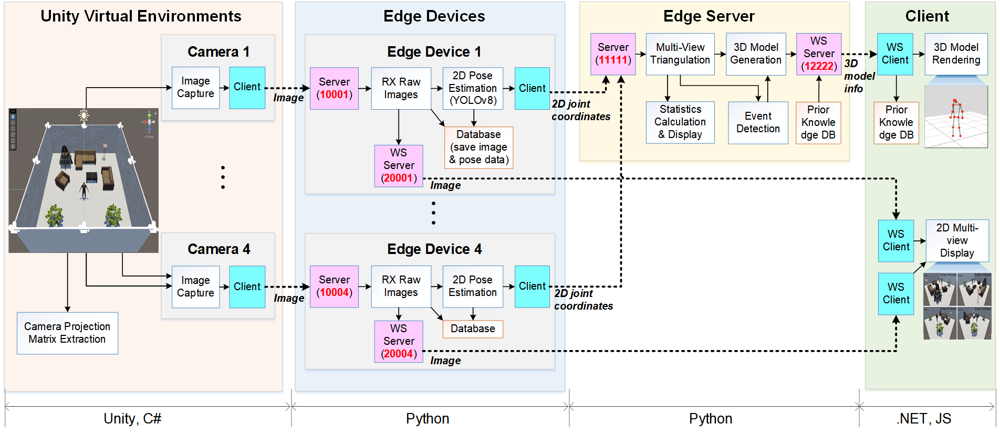

# Project Guide

## Demo Video
<!-- [](https://youtu.be/7HRfl6EmGzI) -->

**Test Video for Cooperative Inference in Real-Time 3D Human Pose Estimation in Multi-Device Edge Networks:**  
(Left) Virtual experimental environment implemented in Unity  
(Right) Client screen visualizing the 3D human skeleton using WebGL

Link: https://youtu.be/7HRfl6EmGzI

---

## Architecture


- `HKPose3D_Unity/`: Captures images from cameras in the Unity virtual environment (Unity project files).
- `HkPose3D_Client/`: Client operation code (.NET6 project, JavaScript files).
- `HkPose3D_Device/`: Edge device source code (Python scripts, `.pt` model files, etc.).
- `HkPose3D_Server/`: Edge server source code (Python scripts, etc.).

---

## Execution Environment and Order
- **Tested on Windows**.
- Execute each project in the following order:
  1. **HkPose3D_Server**
  2. **HkPose3D_Device**
  3. **HkPose3D_Unity**
  4. **HkPose3D_Client**

---

## 1. HKPose3D_Unity  

### How to Run HkPose3D_Unity
1. Install Unity (Version 2022.3.22f1 LTS) and add the project.
2. Configure the relevant parameters below and press the Play button.

### Camera Parameter Configuration
For Cameras 1, 2, 3, and 4, configure the following parameters in `CameraCapture.cs`:
- Edge device IP address (in order of connection).
- Port number (**Note:** Port number is `10000 + Camera Number`).
- Captured image resolution (width, height).
- Capture enable/disable.
- Capture interval.
- Whether to send captured images to the server.
- Whether to save captured images (**Saved in `Captures` folder under respective camera folders**).

### RPM Player Parameter Configuration
Set the following parameters in `ThirdPersonController.cs`:
- Enable/disable avatar.
- Save ground truth 3D joint coordinates of the avatar.
- Save interval for ground truth 3D joint coordinates (**Saved in `Captures/BodyPos3dGT` folder**).

### Avatar Movement & Gesture Controls
- **Arrow keys**: Move avatar.
- **Spacebar**: Jump.
- **Keys 1-6**: Perform predefined gestures:
  - `1`: Spread arms.
  - `2`: Return to default position.
  - `3`: Fall backward.
  - `4`: Fall forward.
  - `5`: Fall sideways.
  - `6`: Fall back and forth.
- **Key Q**: Return to default posture from gesture.

### Additional Notes
- `Captures/Camera#/calibration/` contains projection matrix files:
  - `Camera1_Pmatrix_Unity.txt`: Automatically extracted from Unity.
  - `Camera1_Pmatrix_Est.txt`: Estimated manually from captured images (**default: Unity version used**).
- During the initial project setup in Unity Hub, use the default domain and App ID for `HHAvatar01` and press Accept.
- `Captures/BodyPos3dEST/` contains estimated 3D pose coordinates from `HkPose3D_Server`.

---

## 2. HkPose3D_Device  

### File Descriptions
- `HkPose3D_Device.py`: Python script for edge device operations.
- `yolov8n-pose.pt`: YOLOv8 nano model for pose extraction.
- `warmup.jpg`: Test image for `HkPose3D_Device.py` execution.
- `requirements.txt`: List of required Python modules.

### How to Run HkPose3D_Device
1. Install dependencies:
   ```sh
   pip install -r requirements.txt
   ```
2. Run the script in the terminal:
   ```sh
   python HkPose3D_Device.py <MY_IP> <PORT> <PORT_WS> <SERVER_IP> <SERVER_PORT>
   ```
3. Example commands:
   - Local execution:
     ```sh
     python HkPose3D_Device.py 127.0.0.1 10001 20001 127.0.0.1 11111
     ```
   - When device and server IPs differ:
     ```sh
     python HkPose3D_Device.py 192.168.1.75 10001 20001 192.168.1.72 11111
     ```

   **Note:** `<PORT>` and `<PORT_WS>` are set as `10000 + Camera Number` and `20000 + Camera Number`, respectively.

   Run this command on **4 separate terminal windows** for **4 cameras**.

---

## 3. HkPose3D_Server  

### File Descriptions
- `HkPose3D_Server.py`: Python script for edge server operations.
- `HkPose3D_Estimate_Camera_Matrix.py`: Estimates projection matrices for cameras using Unity-captured images and avatar 3D joint ground truth (**Results saved in `HkPose3D_Unity/Captures/Camera#/calibration/`**).
- `requirements.txt`: List of required Python modules.

### How to Run HkPose3D_Server
1. Install dependencies:
   ```sh
   pip install -r requirements.txt
   ```
2. Run the script in the terminal:
   ```sh
   python HkPose3D_Server.py <IP> <PORT> <IP_WS> <PORT_WS>
   ```
3. Example commands:
   - Local execution:
     ```sh
     python HkPose3D_Server.py 127.0.0.1 11111 127.0.0.1 12222
     ```
   - When device and server IPs differ:
     ```sh
     python HkPose3D_Server.py 192.168.1.72 11111 127.0.0.1 12222
     ```

4. Monitor traffic via **Server Traffic Monitoring** window.

---

## 4. HkPose3D_Client

### File Descriptions
- `HkPose3D_Client` project and solution files: Open the solution in Visual Studio and execute it.

### How to Run HkPose3D_Client
- Press **Ctrl+F5** to run.
- Open a web browser and navigate to:
  - **https://localhost:8081/** or **http://localhost:8080/**
- Click the **3D Pose** or **Video Stream** link in the left sidebar to navigate to the respective page.
- Click **Connect** to view results.
- If the server's IP or port differs, modify it and press **Connect**.
- To ensure stability when switching screens, press **Disconnect** before navigating.

---

## Notes
- Current version supports **up to 4 cameras**.
- Only **one avatar pose extraction** is supported.
- If server and client do not use **localhost (127.0.0.1)**, a CORS error occurs. Use **http://localhost:8080** instead.
- Running all projects on one machine may cause delays and packet drops in the client. Refresh (`F5`) and reconnect to resume operation.
